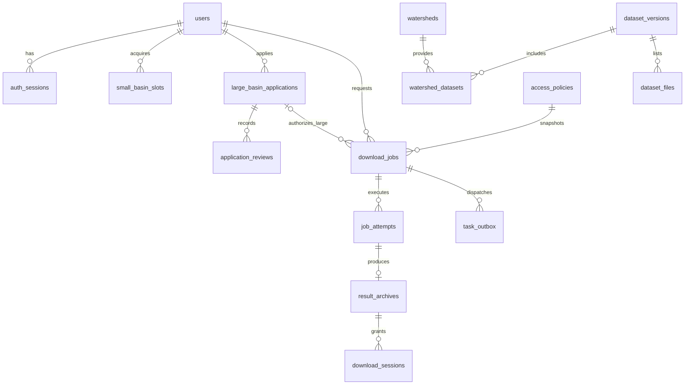

# MySQL 数据库逐字段说明 v1.0

本文依据 database/migrations 中的结构脚本说明 23 张表及其字段。业务数据库实例、账号记录和运行数据不属于本文范围。


## 1. 设计原则与实施状态

- MySQL 8.4、InnoDB，默认 utf8mb4/utf8mb4_0900_ai_ci。编码和令牌字段以各字段明确的 ASCII 字符集/排序规则为准。
- 主业务库 concn_datahub；concn_datahub_test 为独立可清空的测试库。全新设计，不从 SQLite 迁移。
- DATETIME 以 UTC 写入；usage_date 由业务按 Asia/Shanghai 转换。前端显示时转换时区。
- 文件保存在私有磁盘目录；MySQL 存 storage_key、hash、清单及权限，不存源 PFB/ZIP 大对象。
- BINARY(32) 用于 SHA-256 原始 32 字节；对外 JSON/文本显示通常使用 64 位十六进制。
- id BIGINT 多为自增主键；CHAR(32) 任务/申请 ID 为 UUID hex；14 位流域编号始终为字符串。
- 字段 SQL 中 NOT NULL 为必填，NULL 为允许空；DEFAULT 和 COMMENT 保留在字段定义列。
- 已建表不代表该字段对应的完整功能已投产。下文列出当前保留字段和缺口。

## 2. 主要关系



ER 图展示主要业务关系；复合外键、全部约束以下方 SQL 为准。administrative_regions 没有数据库自引用外键，父编码一致性由导入逻辑验证；省市导航不与流域强行建立行政归属外键。

## 3. 表索引

|序号|表|用途|
|---:|---|---|
|1|users|账号主表：存身份、角色、状态、语言和密码哈希。邮箱不区分大小写唯一；当前不代表实名身份。|
|2|auth_sessions|登录会话：服务端保存令牌摘要、有效期和撤销时间；客户端通过 HttpOnly Cookie 持有原始令牌。|
|3|email_actions|邮件操作令牌：邮箱验证、变更邮箱、密码重置。SMTP 未配置时不能完成真实收信链路。|
|4|basin_levels|七级映射字典：hierarchy_level=1–7，pfbas_level=2×hierarchy_level。|
|5|access_policies|规则历史：每次管理员修改生成新记录，历史名额、任务和申请可追溯当时规则。|
|6|platform_config|平台单例配置：id=1，指向当前规则，保存结果保留时间、审批授权时间及维护开关。|
|7|watersheds|流域目录：14 位编码为主键，保留前导零。父子关系、自身级别、面积和地理范围独立保存。|
|8|dataset_versions|数据版本：发布前需要冻结源/参数清单摘要。下架是状态变更，不删除历史申请和任务。|
|9|dataset_files|版本内数据项：五类源 PFB 及生成文件配方；实际大文件保存在私有文件系统。|
|10|watershed_datasets|流域与版本的多对多关联：表示该流域在该版本中的可用性及估计资源需求。|
|11|small_basin_slots|小流域名额：每账号只允许两个槽位，同一编码唯一；reserved 是预留，active 在首次签发下载会话时激活。|
|12|large_basin_applications|大流域申请：单用户、单编码、单版本，保存表单、条款、幂等请求与审核授权。|
|13|application_reviews|审核操作历史：批准、驳回、撤销或用户撤回，保存操作者及意见，不能仅靠申请当前状态代替。|
|14|download_jobs|生成任务：记录授权依据、科学快照、幂等信息、状态、阶段及失败信息；不保存 ZIP 二进制。|
|15|job_attempts|执行尝试：按 job_id+attempt_no 唯一，含 worker 身份、工作目录和租约；支持丢失执行判断。|
|16|result_archives|任务结果：指向特定执行尝试，保存 ZIP 大小、摘要、清单、状态和过期时间。|
|17|download_sessions|文件下载授权：绑定用户、任务和结果；专属令牌摘要、授权时间和传输租约。|
|18|usage_daily|按账号和上海日期聚合的任务/字节计数；当前主要用于统计，没有对应每日硬配额产品。|
|19|task_outbox|任务入队记录：与任务同一事务写入，当前 worker 直接轮询 MySQL；不是已经接入 Redis/RabbitMQ。|
|20|content_pages|公开内容：双语标题/正文、类型、发布状态；已有编辑接口，但没有完整历史版本存储和恢复。|
|21|audit_logs|业务审计：操作者、动作、对象、时间和脱敏细节；不应记录密码及原始令牌。|
|22|administrative_regions|省市导航快照：同一行政编码可同时作为省和市，因此使用(code,kind)复合主键；仅用于定位。|

## 4. 逐表字段与完整约束

### 4.1 users

账号主表：存身份、角色、状态、语言和密码哈希。邮箱不区分大小写唯一；当前不代表实名身份。

|字段|类型、空值、默认值及备注（精确 SQL）|
|---|---|
|id|`BIGINT UNSIGNED NOT NULL AUTO_INCREMENT`|
|username|`VARCHAR(64) NOT NULL`|
|email|`VARCHAR(254) CHARACTER SET ascii COLLATE ascii_general_ci NOT NULL COMMENT 'Canonical ASCII email: trim, lowercase, IDNA domain in application'`|
|password_hash|`VARCHAR(255) CHARACTER SET ascii COLLATE ascii_bin NOT NULL`|
|role|`ENUM('user','admin') NOT NULL DEFAULT 'user'`|
|status|`ENUM('active','disabled') NOT NULL DEFAULT 'active'`|
|preferred_locale|`VARCHAR(5) CHARACTER SET ascii COLLATE ascii_bin NOT NULL DEFAULT 'zh-CN'`|
|email_verified_at|`DATETIME(6) NULL`|
|failed_login_count|`SMALLINT UNSIGNED NOT NULL DEFAULT 0`|
|locked_until|`DATETIME(6) NULL`|
|created_at|`DATETIME(6) NOT NULL DEFAULT CURRENT_TIMESTAMP(6)`|
|updated_at|`DATETIME(6) NOT NULL DEFAULT CURRENT_TIMESTAMP(6) ON UPDATE CURRENT_TIMESTAMP(6)`|

主键、索引及约束：

```sql
PRIMARY KEY (id),
UNIQUE KEY uq_users_username (username),
UNIQUE KEY uq_users_email (email),
CONSTRAINT ck_users_locale CHECK (preferred_locale IN ('zh-CN','en')),
CONSTRAINT ck_users_email_trim CHECK (CHAR_LENGTH(email) = CHAR_LENGTH(TRIM(email)) AND CHAR_LENGTH(email) > 3)
```

### 4.2 auth_sessions

登录会话：服务端保存令牌摘要、有效期和撤销时间；客户端通过 HttpOnly Cookie 持有原始令牌。

|字段|类型、空值、默认值及备注（精确 SQL）|
|---|---|
|id|`BIGINT UNSIGNED NOT NULL AUTO_INCREMENT`|
|user_id|`BIGINT UNSIGNED NOT NULL`|
|token_hash|`BINARY(32) NOT NULL COMMENT 'SHA-256 of high-entropy bearer token; never raw token'`|
|created_at|`DATETIME(6) NOT NULL DEFAULT CURRENT_TIMESTAMP(6)`|
|expires_at|`DATETIME(6) NOT NULL`|
|revoked_at|`DATETIME(6) NULL`|

主键、索引及约束：

```sql
PRIMARY KEY (id),
UNIQUE KEY uq_auth_token (token_hash),
KEY ix_auth_user_expiry (user_id, expires_at),
KEY ix_auth_expiry (expires_at),
CONSTRAINT fk_auth_user FOREIGN KEY (user_id) REFERENCES users(id),
CONSTRAINT ck_auth_expiry CHECK (expires_at > created_at)
```

### 4.3 email_actions

邮件操作令牌：邮箱验证、变更邮箱、密码重置。SMTP 未配置时不能完成真实收信链路。

|字段|类型、空值、默认值及备注（精确 SQL）|
|---|---|
|id|`BIGINT UNSIGNED NOT NULL AUTO_INCREMENT`|
|user_id|`BIGINT UNSIGNED NOT NULL`|
|purpose|`ENUM('verify_email','change_email','reset_password') NOT NULL`|
|target_email|`VARCHAR(254) CHARACTER SET ascii COLLATE ascii_general_ci NOT NULL`|
|token_hash|`BINARY(32) NOT NULL`|
|created_at|`DATETIME(6) NOT NULL DEFAULT CURRENT_TIMESTAMP(6)`|
|expires_at|`DATETIME(6) NOT NULL`|
|consumed_at|`DATETIME(6) NULL`|
|revoked_at|`DATETIME(6) NULL`|

主键、索引及约束：

```sql
PRIMARY KEY (id),
UNIQUE KEY uq_email_action_token (token_hash),
KEY ix_email_action_user (user_id,purpose,created_at),
KEY ix_email_action_expiry (expires_at),
CONSTRAINT fk_email_action_user FOREIGN KEY (user_id) REFERENCES users(id),
CONSTRAINT ck_email_action_expiry CHECK (expires_at > created_at)
```

### 4.4 basin_levels

七级映射字典：hierarchy_level=1–7，pfbas_level=2×hierarchy_level。

|字段|类型、空值、默认值及备注（精确 SQL）|
|---|---|
|pfbas_level|`TINYINT UNSIGNED NOT NULL`|
|hierarchy_level|`TINYINT UNSIGNED NOT NULL`|
|label_zh|`VARCHAR(32) NOT NULL`|
|label_en|`VARCHAR(64) NOT NULL`|

主键、索引及约束：

```sql
PRIMARY KEY (pfbas_level),
UNIQUE KEY uq_basin_hierarchy (hierarchy_level),
CONSTRAINT ck_basin_level_map CHECK (hierarchy_level BETWEEN 1 AND 7 AND pfbas_level = hierarchy_level * 2)
```

### 4.5 access_policies

规则历史：每次管理员修改生成新记录，历史名额、任务和申请可追溯当时规则。

|字段|类型、空值、默认值及备注（精确 SQL）|
|---|---|
|id|`BIGINT UNSIGNED NOT NULL AUTO_INCREMENT`|
|small_min_hierarchy_level|`TINYINT UNSIGNED NOT NULL`|
|reason|`VARCHAR(1000) NOT NULL`|
|created_by|`BIGINT UNSIGNED NULL COMMENT 'NULL only for bootstrap policy'`|
|created_at|`DATETIME(6) NOT NULL DEFAULT CURRENT_TIMESTAMP(6)`|

主键、索引及约束：

```sql
PRIMARY KEY (id),
CONSTRAINT fk_policy_level FOREIGN KEY (small_min_hierarchy_level) REFERENCES basin_levels(hierarchy_level),
CONSTRAINT fk_policy_creator FOREIGN KEY (created_by) REFERENCES users(id)
```

### 4.6 platform_config

平台单例配置：id=1，指向当前规则，保存结果保留时间、审批授权时间及维护开关。

|字段|类型、空值、默认值及备注（精确 SQL）|
|---|---|
|id|`TINYINT UNSIGNED NOT NULL`|
|current_policy_id|`BIGINT UNSIGNED NOT NULL`|
|result_retention_hours|`INT UNSIGNED NOT NULL DEFAULT 72 COMMENT 'Proposed, to confirm'`|
|approval_validity_hours|`INT UNSIGNED NOT NULL DEFAULT 168 COMMENT 'Proposed, to confirm'`|
|maintenance_mode|`BOOLEAN NOT NULL DEFAULT FALSE`|
|updated_by|`BIGINT UNSIGNED NULL`|
|updated_at|`DATETIME(6) NOT NULL DEFAULT CURRENT_TIMESTAMP(6) ON UPDATE CURRENT_TIMESTAMP(6)`|

主键、索引及约束：

```sql
PRIMARY KEY (id),
CONSTRAINT ck_config_singleton CHECK (id = 1),
CONSTRAINT ck_config_retention CHECK (result_retention_hours > 0 AND approval_validity_hours > 0),
CONSTRAINT ck_config_maintenance CHECK (maintenance_mode IN (0,1)),
CONSTRAINT fk_config_policy FOREIGN KEY (current_policy_id) REFERENCES access_policies(id),
CONSTRAINT fk_config_editor FOREIGN KEY (updated_by) REFERENCES users(id)
```

### 4.7 watersheds

流域目录：14 位编码为主键，保留前导零。父子关系、自身级别、面积和地理范围独立保存。

|字段|类型、空值、默认值及备注（精确 SQL）|
|---|---|
|basin_code|`CHAR(14) CHARACTER SET ascii COLLATE ascii_bin NOT NULL`|
|pfbas_level|`TINYINT UNSIGNED NOT NULL`|
|parent_code|`CHAR(14) CHARACTER SET ascii COLLATE ascii_bin NULL`|
|name_zh|`VARCHAR(200) NULL`|
|name_en|`VARCHAR(200) NULL`|
|region_zh|`VARCHAR(100) NULL`|
|region_en|`VARCHAR(100) NULL`|
|area_km2|`DECIMAL(18,6) NULL`|
|center_lng|`DECIMAL(11,7) NULL`|
|center_lat|`DECIMAL(10,7) NULL`|
|bbox_wgs84|`JSON NULL`|
|status|`ENUM('available','unavailable') NOT NULL DEFAULT 'unavailable'`|
|created_at|`DATETIME(6) NOT NULL DEFAULT CURRENT_TIMESTAMP(6)`|

主键、索引及约束：

```sql
PRIMARY KEY (basin_code),
KEY ix_watershed_level (pfbas_level,status,basin_code),
KEY ix_watershed_parent (parent_code),
KEY ix_watershed_name_zh (name_zh),
KEY ix_watershed_name_en (name_en),
CONSTRAINT fk_watershed_level FOREIGN KEY (pfbas_level) REFERENCES basin_levels(pfbas_level),
CONSTRAINT fk_watershed_parent FOREIGN KEY (parent_code) REFERENCES watersheds(basin_code),
CONSTRAINT ck_watershed_code CHECK (REGEXP_LIKE(basin_code,'^[0-9]{14}$','c')),
CONSTRAINT ck_watershed_parent CHECK (parent_code IS NULL OR parent_code <> basin_code),
CONSTRAINT ck_watershed_area CHECK (area_km2 IS NULL OR area_km2 >= 0),
CONSTRAINT ck_watershed_lng CHECK (center_lng IS NULL OR center_lng BETWEEN -180 AND 180),
CONSTRAINT ck_watershed_lat CHECK (center_lat IS NULL OR center_lat BETWEEN -90 AND 90)
```

### 4.8 dataset_versions

数据版本：发布前需要冻结源/参数清单摘要。下架是状态变更，不删除历史申请和任务。

|字段|类型、空值、默认值及备注（精确 SQL）|
|---|---|
|id|`BIGINT UNSIGNED NOT NULL AUTO_INCREMENT`|
|version_code|`VARCHAR(64) CHARACTER SET ascii COLLATE ascii_bin NOT NULL`|
|title_zh|`VARCHAR(200) NOT NULL`|
|title_en|`VARCHAR(200) NOT NULL`|
|description_zh|`TEXT NULL`|
|description_en|`TEXT NULL`|
|status|`ENUM('draft','published','withdrawn') NOT NULL DEFAULT 'draft'`|
|boundary_version|`VARCHAR(100) NOT NULL`|
|clip_version|`VARCHAR(100) NOT NULL`|
|manifest_sha256|`BINARY(32) NULL COMMENT 'Frozen source/parameter manifest digest'`|
|grid_metadata|`JSON NOT NULL`|
|citation|`TEXT NOT NULL`|
|terms_version|`VARCHAR(64) NOT NULL`|
|license_text_zh|`TEXT NOT NULL`|
|license_text_en|`TEXT NOT NULL`|
|published_at|`DATETIME(6) NULL`|
|created_by|`BIGINT UNSIGNED NULL`|
|created_at|`DATETIME(6) NOT NULL DEFAULT CURRENT_TIMESTAMP(6)`|

主键、索引及约束：

```sql
PRIMARY KEY (id),
UNIQUE KEY uq_dataset_version (version_code),
CONSTRAINT fk_dataset_creator FOREIGN KEY (created_by) REFERENCES users(id),
CONSTRAINT ck_dataset_publish CHECK (status <> 'published' OR (published_at IS NOT NULL AND manifest_sha256 IS NOT NULL))
```

### 4.9 dataset_files

版本内数据项：五类源 PFB 及生成文件配方；实际大文件保存在私有文件系统。

|字段|类型、空值、默认值及备注（精确 SQL）|
|---|---|
|id|`BIGINT UNSIGNED NOT NULL AUTO_INCREMENT`|
|dataset_version_id|`BIGINT UNSIGNED NOT NULL`|
|item_code|`VARCHAR(64) CHARACTER SET ascii COLLATE ascii_bin NOT NULL`|
|title_zh|`VARCHAR(200) NOT NULL`|
|title_en|`VARCHAR(200) NOT NULL`|
|units|`VARCHAR(100) NULL`|
|storage_key|`VARCHAR(1000) NOT NULL COMMENT 'Private logical source key or generated recipe key'`|
|file_kind|`ENUM('source','generated') NOT NULL`|
|source_sha256|`BINARY(32) NULL`|
|output_name_template|`VARCHAR(255) NOT NULL`|
|metadata|`JSON NULL`|

主键、索引及约束：

```sql
PRIMARY KEY (id),
UNIQUE KEY uq_dataset_item (dataset_version_id,item_code),
CONSTRAINT fk_dataset_file_version FOREIGN KEY (dataset_version_id) REFERENCES dataset_versions(id)
```

### 4.10 watershed_datasets

流域与版本的多对多关联：表示该流域在该版本中的可用性及估计资源需求。

|字段|类型、空值、默认值及备注（精确 SQL）|
|---|---|
|basin_code|`CHAR(14) CHARACTER SET ascii COLLATE ascii_bin NOT NULL`|
|dataset_version_id|`BIGINT UNSIGNED NOT NULL`|
|status|`ENUM('available','unavailable') NOT NULL DEFAULT 'unavailable'`|
|unavailable_reason_zh|`VARCHAR(1000) NULL`|
|unavailable_reason_en|`VARCHAR(1000) NULL`|
|estimated_zip_bytes|`BIGINT UNSIGNED NULL`|
|estimated_peak_memory_bytes|`BIGINT UNSIGNED NULL`|
|boundary_storage_key|`VARCHAR(1000) NULL`|

主键、索引及约束：

```sql
PRIMARY KEY (basin_code,dataset_version_id),
KEY ix_availability_version (dataset_version_id,status,basin_code),
CONSTRAINT fk_availability_basin FOREIGN KEY (basin_code) REFERENCES watersheds(basin_code),
CONSTRAINT fk_availability_version FOREIGN KEY (dataset_version_id) REFERENCES dataset_versions(id)
```

### 4.11 small_basin_slots

小流域名额：每账号只允许两个槽位，同一编码唯一；reserved 是预留，active 在首次签发下载会话时激活。

|字段|类型、空值、默认值及备注（精确 SQL）|
|---|---|
|user_id|`BIGINT UNSIGNED NOT NULL`|
|slot_no|`TINYINT UNSIGNED NOT NULL`|
|basin_code|`CHAR(14) CHARACTER SET ascii COLLATE ascii_bin NOT NULL`|
|policy_id|`BIGINT UNSIGNED NOT NULL`|
|state|`ENUM('reserved','active') NOT NULL DEFAULT 'reserved'`|
|reserved_at|`DATETIME(6) NOT NULL DEFAULT CURRENT_TIMESTAMP(6)`|
|activated_at|`DATETIME(6) NULL`|

主键、索引及约束：

```sql
PRIMARY KEY (user_id,slot_no),
UNIQUE KEY uq_small_slot_basin (user_id,basin_code),
KEY ix_small_reservations (state,reserved_at),
CONSTRAINT ck_small_slot_two CHECK (slot_no IN (1,2)),
CONSTRAINT ck_small_slot_activation CHECK ((state='reserved' AND activated_at IS NULL) OR (state='active' AND activated_at IS NOT NULL)),
CONSTRAINT fk_small_slot_user FOREIGN KEY (user_id) REFERENCES users(id),
CONSTRAINT fk_small_slot_basin FOREIGN KEY (basin_code) REFERENCES watersheds(basin_code),
CONSTRAINT fk_small_slot_policy FOREIGN KEY (policy_id) REFERENCES access_policies(id)
```

### 4.12 large_basin_applications

大流域申请：单用户、单编码、单版本，保存表单、条款、幂等请求与审核授权。

|字段|类型、空值、默认值及备注（精确 SQL）|
|---|---|
|id|`CHAR(32) CHARACTER SET ascii COLLATE ascii_bin NOT NULL COMMENT 'Random UUID hex'`|
|user_id|`BIGINT UNSIGNED NOT NULL`|
|basin_code|`CHAR(14) CHARACTER SET ascii COLLATE ascii_bin NOT NULL`|
|dataset_version_id|`BIGINT UNSIGNED NOT NULL`|
|policy_id|`BIGINT UNSIGNED NOT NULL`|
|package_mode|`VARCHAR(16) CHARACTER SET ascii COLLATE ascii_bin NOT NULL DEFAULT 'full'`|
|applicant_name|`VARCHAR(100) NOT NULL`|
|affiliation|`VARCHAR(255) NOT NULL`|
|contact_email|`VARCHAR(254) CHARACTER SET ascii COLLATE ascii_general_ci NOT NULL`|
|usage_type|`ENUM('project','thesis') NOT NULL DEFAULT 'project'`|
|usage_title|`VARCHAR(255) NOT NULL DEFAULT ''`|
|usage_owner|`VARCHAR(255) NOT NULL DEFAULT ''`|
|purpose|`TEXT NOT NULL`|
|large_basin_reason|`TEXT NULL`，已停用，仅保留历史值|
|project_url|`VARCHAR(2000) NULL`|
|terms_version|`VARCHAR(64) NOT NULL`|
|terms_accepted_at|`DATETIME(6) NOT NULL`|
|request_snapshot|`JSON NOT NULL`|
|idempotency_key|`VARCHAR(64) CHARACTER SET ascii COLLATE ascii_bin NOT NULL`|
|request_hash|`BINARY(32) NOT NULL`|
|status|`ENUM('pending','approved','rejected','withdrawn','revoked') NOT NULL DEFAULT 'pending'`|
|reviewed_by|`BIGINT UNSIGNED NULL`|
|reviewed_at|`DATETIME(6) NULL`|
|review_comment|`TEXT NULL`|
|authorization_expires_at|`DATETIME(6) NULL`|
|revoked_at|`DATETIME(6) NULL`|
|submitted_at|`DATETIME(6) NOT NULL DEFAULT CURRENT_TIMESTAMP(6)`|

主键、索引及约束：

```sql
PRIMARY KEY (id),
UNIQUE KEY uq_application_idempotency (user_id,idempotency_key),
UNIQUE KEY uq_application_scope (id,user_id,basin_code,dataset_version_id),
KEY ix_application_inbox (status,submitted_at,id),
KEY ix_application_history (user_id,submitted_at,id),
CONSTRAINT fk_application_user FOREIGN KEY (user_id) REFERENCES users(id),
CONSTRAINT fk_application_dataset FOREIGN KEY (basin_code,dataset_version_id) REFERENCES watershed_datasets(basin_code,dataset_version_id),
CONSTRAINT fk_application_policy FOREIGN KEY (policy_id) REFERENCES access_policies(id),
CONSTRAINT fk_application_reviewer FOREIGN KEY (reviewed_by) REFERENCES users(id),
CONSTRAINT ck_application_full CHECK (package_mode='full'),
CONSTRAINT ck_application_review CHECK (status NOT IN ('approved','rejected','revoked') OR (reviewed_by IS NOT NULL AND reviewed_at IS NOT NULL AND review_comment IS NOT NULL)),
CONSTRAINT ck_application_grant CHECK (status NOT IN ('approved','revoked') OR (authorization_expires_at IS NOT NULL AND authorization_expires_at > reviewed_at)),
CONSTRAINT ck_application_revoke CHECK (status <> 'revoked' OR revoked_at IS NOT NULL)
```

### 4.13 application_reviews

审核操作历史：批准、驳回、撤销或用户撤回，保存操作者及意见，不能仅靠申请当前状态代替。

|字段|类型、空值、默认值及备注（精确 SQL）|
|---|---|
|id|`BIGINT UNSIGNED NOT NULL AUTO_INCREMENT`|
|application_id|`CHAR(32) CHARACTER SET ascii COLLATE ascii_bin NOT NULL`|
|actor_user_id|`BIGINT UNSIGNED NOT NULL`|
|action|`ENUM('approve','reject','revoke','withdraw') NOT NULL`|
|comment|`TEXT NOT NULL`|
|created_at|`DATETIME(6) NOT NULL DEFAULT CURRENT_TIMESTAMP(6)`|

主键、索引及约束：

```sql
PRIMARY KEY (id),
KEY ix_review_application (application_id,created_at,id),
CONSTRAINT fk_review_application FOREIGN KEY (application_id) REFERENCES large_basin_applications(id),
CONSTRAINT fk_review_actor FOREIGN KEY (actor_user_id) REFERENCES users(id)
```

### 4.14 download_jobs

生成任务：记录授权依据、科学快照、幂等信息、状态、阶段及失败信息；不保存 ZIP 二进制。

|字段|类型、空值、默认值及备注（精确 SQL）|
|---|---|
|id|`CHAR(32) CHARACTER SET ascii COLLATE ascii_bin NOT NULL`|
|user_id|`BIGINT UNSIGNED NOT NULL`|
|basin_code|`CHAR(14) CHARACTER SET ascii COLLATE ascii_bin NOT NULL`|
|dataset_version_id|`BIGINT UNSIGNED NOT NULL`|
|policy_id|`BIGINT UNSIGNED NOT NULL`|
|access_mode|`ENUM('small','approved_large') NOT NULL`|
|application_id|`CHAR(32) CHARACTER SET ascii COLLATE ascii_bin NULL`|
|package_mode|`VARCHAR(16) CHARACTER SET ascii COLLATE ascii_bin NOT NULL DEFAULT 'full'`|
|request_snapshot|`JSON NOT NULL`|
|idempotency_key|`VARCHAR(64) CHARACTER SET ascii COLLATE ascii_bin NOT NULL`|
|request_hash|`BINARY(32) NOT NULL`|
|terms_version|`VARCHAR(64) NOT NULL`|
|terms_accepted_at|`DATETIME(6) NOT NULL`|
|status|`ENUM('queued','running','packaging','succeeded','failed','cancel_requested','cancelled','expired') NOT NULL DEFAULT 'queued'`|
|stage_code|`VARCHAR(64) CHARACTER SET ascii COLLATE ascii_bin NULL`|
|current_attempt|`INT UNSIGNED NOT NULL DEFAULT 0`|
|heartbeat_at|`DATETIME(6) NULL`|
|error_code|`VARCHAR(64) CHARACTER SET ascii COLLATE ascii_bin NULL`|
|error_params|`JSON NULL`|
|created_at|`DATETIME(6) NOT NULL DEFAULT CURRENT_TIMESTAMP(6)`|
|updated_at|`DATETIME(6) NOT NULL DEFAULT CURRENT_TIMESTAMP(6) ON UPDATE CURRENT_TIMESTAMP(6)`|
|finished_at|`DATETIME(6) NULL`|

主键、索引及约束：

```sql
PRIMARY KEY (id),
UNIQUE KEY uq_job_owner (id,user_id),
UNIQUE KEY uq_job_idempotency (user_id,idempotency_key),
KEY ix_job_history (user_id,created_at,id),
KEY ix_job_queue (status,created_at,id),
KEY ix_job_slot_refs (user_id,basin_code,access_mode,status),
CONSTRAINT fk_job_user FOREIGN KEY (user_id) REFERENCES users(id),
CONSTRAINT fk_job_dataset FOREIGN KEY (basin_code,dataset_version_id) REFERENCES watershed_datasets(basin_code,dataset_version_id),
CONSTRAINT fk_job_policy FOREIGN KEY (policy_id) REFERENCES access_policies(id),
CONSTRAINT fk_job_application_scope FOREIGN KEY (application_id,user_id,basin_code,dataset_version_id) REFERENCES large_basin_applications(id,user_id,basin_code,dataset_version_id),
CONSTRAINT ck_job_access CHECK ((access_mode='small' AND application_id IS NULL) OR (access_mode='approved_large' AND application_id IS NOT NULL)),
CONSTRAINT ck_job_full CHECK (package_mode='full')
```

### 4.15 job_attempts

执行尝试：按 job_id+attempt_no 唯一，含 worker 身份、工作目录和租约；支持丢失执行判断。

|字段|类型、空值、默认值及备注（精确 SQL）|
|---|---|
|job_id|`CHAR(32) CHARACTER SET ascii COLLATE ascii_bin NOT NULL`|
|attempt_no|`INT UNSIGNED NOT NULL`|
|worker_id|`VARCHAR(128) CHARACTER SET ascii COLLATE ascii_bin NOT NULL`|
|state|`ENUM('running','succeeded','failed','cancelled','lost') NOT NULL DEFAULT 'running'`|
|lease_expires_at|`DATETIME(6) NOT NULL`|
|work_storage_key|`VARCHAR(1000) NOT NULL`|
|error_code|`VARCHAR(64) CHARACTER SET ascii COLLATE ascii_bin NULL`|
|started_at|`DATETIME(6) NOT NULL DEFAULT CURRENT_TIMESTAMP(6)`|
|finished_at|`DATETIME(6) NULL`|

主键、索引及约束：

```sql
PRIMARY KEY (job_id,attempt_no),
KEY ix_attempt_leases (state,lease_expires_at),
CONSTRAINT fk_attempt_job FOREIGN KEY (job_id) REFERENCES download_jobs(id),
CONSTRAINT ck_attempt_number CHECK (attempt_no > 0)
```

### 4.16 result_archives

任务结果：指向特定执行尝试，保存 ZIP 大小、摘要、清单、状态和过期时间。

|字段|类型、空值、默认值及备注（精确 SQL）|
|---|---|
|id|`CHAR(32) CHARACTER SET ascii COLLATE ascii_bin NOT NULL`|
|job_id|`CHAR(32) CHARACTER SET ascii COLLATE ascii_bin NOT NULL`|
|attempt_no|`INT UNSIGNED NOT NULL`|
|storage_key|`VARCHAR(1000) NOT NULL`|
|byte_size|`BIGINT UNSIGNED NOT NULL`|
|sha256|`BINARY(32) NOT NULL`|
|file_manifest|`JSON NOT NULL`|
|state|`ENUM('available','deleting','deleted','revoked') NOT NULL DEFAULT 'available'`|
|created_at|`DATETIME(6) NOT NULL DEFAULT CURRENT_TIMESTAMP(6)`|
|expires_at|`DATETIME(6) NOT NULL`|
|deleted_at|`DATETIME(6) NULL`|

主键、索引及约束：

```sql
PRIMARY KEY (id),
UNIQUE KEY uq_archive_job (job_id),
UNIQUE KEY uq_archive_scope (id,job_id),
KEY ix_archive_cleanup (state,expires_at),
CONSTRAINT fk_archive_attempt FOREIGN KEY (job_id,attempt_no) REFERENCES job_attempts(job_id,attempt_no),
CONSTRAINT ck_archive_size CHECK (byte_size > 0),
CONSTRAINT ck_archive_expiry CHECK (expires_at > created_at)
```

### 4.17 download_sessions

文件下载授权：绑定用户、任务和结果；专属令牌摘要、授权时间和传输租约。

|字段|类型、空值、默认值及备注（精确 SQL）|
|---|---|
|id|`CHAR(32) CHARACTER SET ascii COLLATE ascii_bin NOT NULL`|
|user_id|`BIGINT UNSIGNED NOT NULL`|
|job_id|`CHAR(32) CHARACTER SET ascii COLLATE ascii_bin NOT NULL`|
|archive_id|`CHAR(32) CHARACTER SET ascii COLLATE ascii_bin NOT NULL`|
|token_hash|`BINARY(32) NOT NULL`|
|authorized_bytes|`BIGINT UNSIGNED NOT NULL`|
|transferred_bytes|`BIGINT UNSIGNED NOT NULL DEFAULT 0 COMMENT 'Actual transport logs, may exceed file size due to retries'`|
|status|`ENUM('active','revoked','expired') NOT NULL DEFAULT 'active'`|
|transfer_lease_until|`DATETIME(6) NULL COMMENT 'File service renews while transmitting; cleanup must honor this lease'`|
|usage_date|`DATE NOT NULL COMMENT 'Asia/Shanghai accounting date, computed by service'`|
|created_at|`DATETIME(6) NOT NULL DEFAULT CURRENT_TIMESTAMP(6)`|
|expires_at|`DATETIME(6) NOT NULL`|

主键、索引及约束：

```sql
PRIMARY KEY (id),
UNIQUE KEY uq_download_token (token_hash),
KEY ix_download_history (user_id,created_at,id),
KEY ix_download_active (archive_id,status,expires_at),
CONSTRAINT fk_download_owner FOREIGN KEY (job_id,user_id) REFERENCES download_jobs(id,user_id),
CONSTRAINT fk_download_archive FOREIGN KEY (archive_id,job_id) REFERENCES result_archives(id,job_id),
CONSTRAINT ck_download_expiry CHECK (expires_at > created_at)
```

### 4.18 usage_daily

按账号和上海日期聚合的任务/字节计数；当前主要用于统计，没有对应每日硬配额产品。

|字段|类型、空值、默认值及备注（精确 SQL）|
|---|---|
|user_id|`BIGINT UNSIGNED NOT NULL`|
|usage_date|`DATE NOT NULL`|
|accepted_jobs|`INT UNSIGNED NOT NULL DEFAULT 0`|
|authorized_bytes|`BIGINT UNSIGNED NOT NULL DEFAULT 0`|
|transferred_bytes|`BIGINT UNSIGNED NOT NULL DEFAULT 0`|

主键、索引及约束：

```sql
PRIMARY KEY (user_id,usage_date),
CONSTRAINT fk_usage_user FOREIGN KEY (user_id) REFERENCES users(id)
```

### 4.19 task_outbox

任务入队记录：与任务同一事务写入，当前 worker 直接轮询 MySQL；不是已经接入 Redis/RabbitMQ。

|字段|类型、空值、默认值及备注（精确 SQL）|
|---|---|
|id|`BIGINT UNSIGNED NOT NULL AUTO_INCREMENT`|
|job_id|`CHAR(32) CHARACTER SET ascii COLLATE ascii_bin NOT NULL`|
|dispatch_no|`INT UNSIGNED NOT NULL DEFAULT 1`|
|state|`ENUM('pending','publishing','published') NOT NULL DEFAULT 'pending'`|
|next_attempt_at|`DATETIME(6) NOT NULL DEFAULT CURRENT_TIMESTAMP(6)`|
|lease_expires_at|`DATETIME(6) NULL`|
|publish_attempts|`INT UNSIGNED NOT NULL DEFAULT 0`|
|published_at|`DATETIME(6) NULL`|
|created_at|`DATETIME(6) NOT NULL DEFAULT CURRENT_TIMESTAMP(6)`|

主键、索引及约束：

```sql
PRIMARY KEY (id),
UNIQUE KEY uq_outbox_dispatch (job_id,dispatch_no),
KEY ix_outbox_due (state,next_attempt_at),
CONSTRAINT fk_outbox_job FOREIGN KEY (job_id) REFERENCES download_jobs(id),
CONSTRAINT ck_outbox_dispatch CHECK (dispatch_no > 0)
```

### 4.20 content_pages

公开内容：双语标题/正文、类型、发布状态；已有编辑接口，但没有完整历史版本存储和恢复。

|字段|类型、空值、默认值及备注（精确 SQL）|
|---|---|
|id|`BIGINT UNSIGNED NOT NULL AUTO_INCREMENT`|
|slug|`VARCHAR(128) CHARACTER SET ascii COLLATE ascii_bin NOT NULL`|
|kind|`ENUM('home','help','notice','terms','privacy') NOT NULL`|
|title_zh|`VARCHAR(200) NOT NULL`|
|title_en|`VARCHAR(200) NOT NULL`|
|body_zh|`MEDIUMTEXT NOT NULL`|
|body_en|`MEDIUMTEXT NOT NULL`|
|status|`ENUM('draft','published','archived') NOT NULL DEFAULT 'draft'`|
|content_version|`INT UNSIGNED NOT NULL DEFAULT 1`|
|published_at|`DATETIME(6) NULL`|
|updated_by|`BIGINT UNSIGNED NULL`|
|updated_at|`DATETIME(6) NOT NULL DEFAULT CURRENT_TIMESTAMP(6) ON UPDATE CURRENT_TIMESTAMP(6)`|

主键、索引及约束：

```sql
PRIMARY KEY (id),
UNIQUE KEY uq_content_slug (slug),
KEY ix_content_public (kind,status,published_at),
CONSTRAINT fk_content_editor FOREIGN KEY (updated_by) REFERENCES users(id)
```

### 4.21 audit_logs

业务审计：操作者、动作、对象、时间和脱敏细节；不应记录密码及原始令牌。

|字段|类型、空值、默认值及备注（精确 SQL）|
|---|---|
|id|`BIGINT UNSIGNED NOT NULL AUTO_INCREMENT`|
|actor_user_id|`BIGINT UNSIGNED NULL COMMENT 'NULL for system events'`|
|action_code|`VARCHAR(100) CHARACTER SET ascii COLLATE ascii_bin NOT NULL`|
|object_type|`VARCHAR(64) CHARACTER SET ascii COLLATE ascii_bin NOT NULL`|
|object_id|`VARCHAR(128) CHARACTER SET ascii COLLATE ascii_bin NOT NULL`|
|trace_id|`CHAR(32) CHARACTER SET ascii COLLATE ascii_bin NULL`|
|details|`JSON NOT NULL COMMENT 'Redacted before/after/reason; never passwords or raw tokens'`|
|created_at|`DATETIME(6) NOT NULL DEFAULT CURRENT_TIMESTAMP(6)`|

主键、索引及约束：

```sql
PRIMARY KEY (id),
KEY ix_audit_object (object_type,object_id,created_at),
KEY ix_audit_actor (actor_user_id,created_at),
CONSTRAINT fk_audit_actor FOREIGN KEY (actor_user_id) REFERENCES users(id)
```

### 4.22 administrative_regions

省市导航快照：同一行政编码可同时作为省和市，因此使用(code,kind)复合主键；仅用于定位。

|字段|类型、空值、默认值及备注（精确 SQL）|
|---|---|
|code|`CHAR(6) CHARACTER SET ascii NOT NULL`|
|kind|`ENUM('province','city') NOT NULL`|
|parent_code|`CHAR(6) CHARACTER SET ascii NULL`|
|name_zh|`VARCHAR(100) NOT NULL`|
|center_lng|`DOUBLE NOT NULL`|
|center_lat|`DOUBLE NOT NULL`|
|view_bounds|`JSON NOT NULL`|
|source_url|`VARCHAR(255) NOT NULL`|
|imported_at|`DATETIME NOT NULL DEFAULT CURRENT_TIMESTAMP`|

主键、索引及约束：

```sql
PRIMARY KEY(code,kind),
KEY ix_region_parent(kind,parent_code,code)
```

## 5. 事务、并发与状态语义

### 5.1 小流域

锁 platform_config 单例及 users 后检查名额。slot_no 仅 1/2，(user_id,basin_code) 唯一。提交任务与预留、outbox、用量统计在事务中完成。成功生成不是 active 激活节点，首次创建有效 download_session 时激活。失败/取消/过期清理只释放无其他活跃引用的 reserved 槽位，不删除 active。

### 5.2 审批

申请状态为 pending、approved、rejected、withdrawn、revoked；超期通常通过 authorization_expires_at 动态判断，不存在必须更新到 expired 的申请枚举。审核约束要求审查人、时间、意见；批准后必须有晚于审核时间的授权截止时间。用户/流域/版本必须与下载任务申请范围一致。

### 5.3 任务和结果

任务允许 queued/running/packaging/succeeded/failed/cancel_requested/cancelled/expired。并非所有任务都会逐个经过每个状态；当前 worker 子流程包含打包，但阶段展示有限。执行租约过期不能视为成功。只有完成结果登记才可下载。result_archives 每任务唯一，必须对应真实执行尝试。

### 5.4 下载及统计

下载 session 同时受账号会话、专属 Cookie、结果状态、版本状态及大流域授权约束。authorized_bytes 是授权的文件总量，重复签发会增加；transferred_bytes 是服务端累计流式传输计数，可因 Range/重试超过文件大小，不等于客户端已持久化的唯一字节或独立下载人数。使用统计作为计费依据前需另定口径。

### 5.5 幂等

申请和任务的 (user_id,idempotency_key) 各自唯一，同键同请求返回旧记录，同键异请求冲突。前端请求键是非权限凭据；兼容 LAN HTTP 的 UUID 生成不削弱服务端授权。任务还按用户/版本/流域/授权范围复用在途任务及有效结果。

### 5.6 内容与审计

content_pages 保存最新内容，更新写审计；当前 content_version 没有配套历史内容表/回滚入口，不能承诺版本恢复。audit_logs 是业务数据库内记录，不是防篡改外部归档。审计中敏感字段需要持续审查。

## 6. 索引设计意图

- users 邮箱/用户名唯一索引承担注册判重；必须保留数据库约束，不只依赖前端。
- watersheds 主键支持 14 位精确查询；原 name 索引为历史结构，当前前台禁用名称搜索，保留历史索引定义。
- (pfbas_level,status,basin_code) 支持按级别和可用性检索；parent_code 支持层级关系。
- 申请和任务的 (user_id,created/submitted_at,id) 用于个人历史；状态队列索引用于管理员待处理与 worker 领取。
- archive 清理、attempt 租约、outbox 到期索引支持维护扫描。
- administrative_regions(kind,parent_code,code) 支持省市级联加载。
- 目前未有空间数据库索引、全文检索服务或单独分析数仓；新增索引需用真实查询计划和数据规模验证。

## 7. 保留字段与实现边界

|字段/结构|现状|后续可能工作|
|---|---|---|
|dataset_files.units/metadata|结构支持；当前部分数据科学释义/单位未完整填写|数据负责人补充权威字典|
|watershed_datasets.estimated_zip_bytes|可以为空|按实际生成结果校准估计|
|estimated_peak_memory_bytes|导入可生成粗估值|未作为可靠的任务内存硬限制|
|boundary_storage_key|结构保留|当前主要按文件目录和级别读取|
|job_attempts.attempt_no|支持多次尝试的结构|当前没有无限自动重试产品|
|task_outbox.publishing 等|保留分发结构|当前直接轮询，无独立消息中间件|
|download_sessions.revoked/expired|枚举允许|部分到期通过时间即时判断，不依赖批量更新枚举|
|content_pages.archived/content_version|结构存在|API 当前仅编辑 draft/published，缺历史版本/归档管理|
|audit_logs.trace_id|可为空|全链路 trace 覆盖仍需完善|
|username/name 字段|仍保留|名称搜索已关闭，但不是删除名称数据|
|usage_daily|统计计数|没有按日硬配额或付费功能|

## 8. 数据保留、备份与迁移

已激活名额、申请审核历史、科学版本清单不得作为普通缓存清理。结果 ZIP 可以按保留策略过期；当前自动清理不等于任务临时目录和日志全部自动清理。个人信息、会话、邮件令牌、审计记录的长期保留/删除策略需项目负责人确认。

001_schema.sql 只用于新空库，不在现有库重跑。002_regions.sql 增加省市表。后续新增编号迁移，实施前备份并在恢复副本验证，不直接改已发布 SQL 的含义。当前无自动迁移版本表或工具。

备份需同时考虑业务数据库、源数据、冻结清单、转换器、代码和有效结果；仅导出 MySQL 不能恢复缺失科学源文件。数据库备份含个人信息和哈希，应限制访问并加密保存；传递给项目负责人的本附录不含真实用户记录或任何密码。

## 9. 交付核对

- 22 张表已覆盖；字段、类型、默认值、约束和索引来自当前建表脚本。
- 新环境执行 001、002、种子数据的顺序与部署说明保持一致。
- 正式生产运行账号只授必需 DML 权限，迁移账号与运行账号分离。
- 名额并发、审批作用域、会话归属、幂等冲突由集成测试验证。
- 是否引入内容历史表、数据库迁移记录、监控指标表、运维任务表属于后续设计，不计为已实现。

## notification_reads

保存每个用户的通知已读状态。实际通知从该用户 application_reviews 的通过、驳回、撤销事件及 result_archives 的生成事件获取，不重复存储业务内容。GET /api/notifications 按当前登录用户返回分页通知、总数和未读数；POST /api/notifications/read 仅标记当前账号的已有事件。

| 字段 | 类型 | 说明 |
|---|---|---|
| user_id | BIGINT UNSIGNED NOT NULL | users.id 外键，删除用户时级联删除已读状态 |
| event_key | VARCHAR(80) ASCII NOT NULL | review:审批记录ID 或 archive:结果ID |
| read_at | DATETIME(6) NOT NULL | 默认当前时间，首次标为已读的时间 |

主键为 (user_id,event_key)，禁止重复已读记录。执行新增的 003_notification_reads.sql 即可升级，不清空任何原表。应用数据库用户无建表权限，升级需由 MySQL 管理账户执行。通知为站内查询展示，没有邮件或浏览器推送。

## 下载用途与包规范

表数量仍为 23，无新增迁移。download_jobs.request_snapshot 新增 download_affiliation（科研单位，1–100字符）和 download_purpose（下载用途，1–200字符）；地图表单要求填写，旧接口调用允许同时省略并保存空字符串。字段去首尾空白，仅保存在任务快照，不写入 ZIP。相同流域但用途/单位不同的请求不按旧结果复用条件合并。当前用户和管理员任务列表不投影这两个字段。

package_revision 已更新为带引用的包规范标识，用于避免新任务复用旧格式归档。新包共11个文件，包含平台生成的 CITATION.txt，不包含 README.txt、SHA256SUMS.txt；数据库历史 dataset_files 定义未批量重写。最新业务说明见[需求规格说明书](需求规格说明书.md)，接口见[后端API接口文档](后端API接口文档.md)。

## 申请表用途字段

执行 004_application_usage.sql 升级，表数量仍为 23。large_basin_applications 新增 usage_type（project/thesis）、usage_title（项目名称或论文题目，≤255）、usage_owner（项目负责人自由文本，论文时为 master/doctor/journal 代号）。原先重复的“使用目的”与“申请原因”两栏合并：purpose 保留为申请理由，large_basin_reason 置为可空且新申请不再写入，历史行原值不动。应用数据库用户无建表权限，升级需由 MySQL 管理账户执行。
